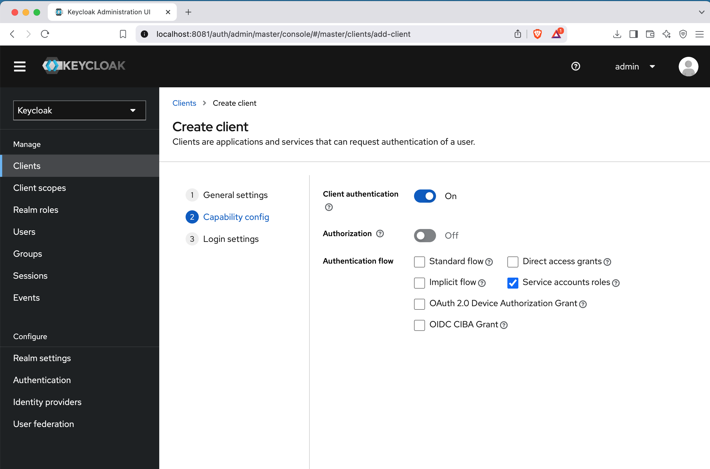
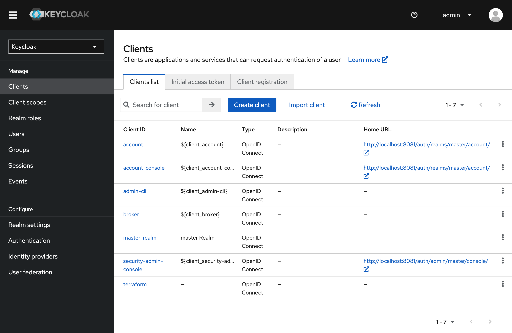
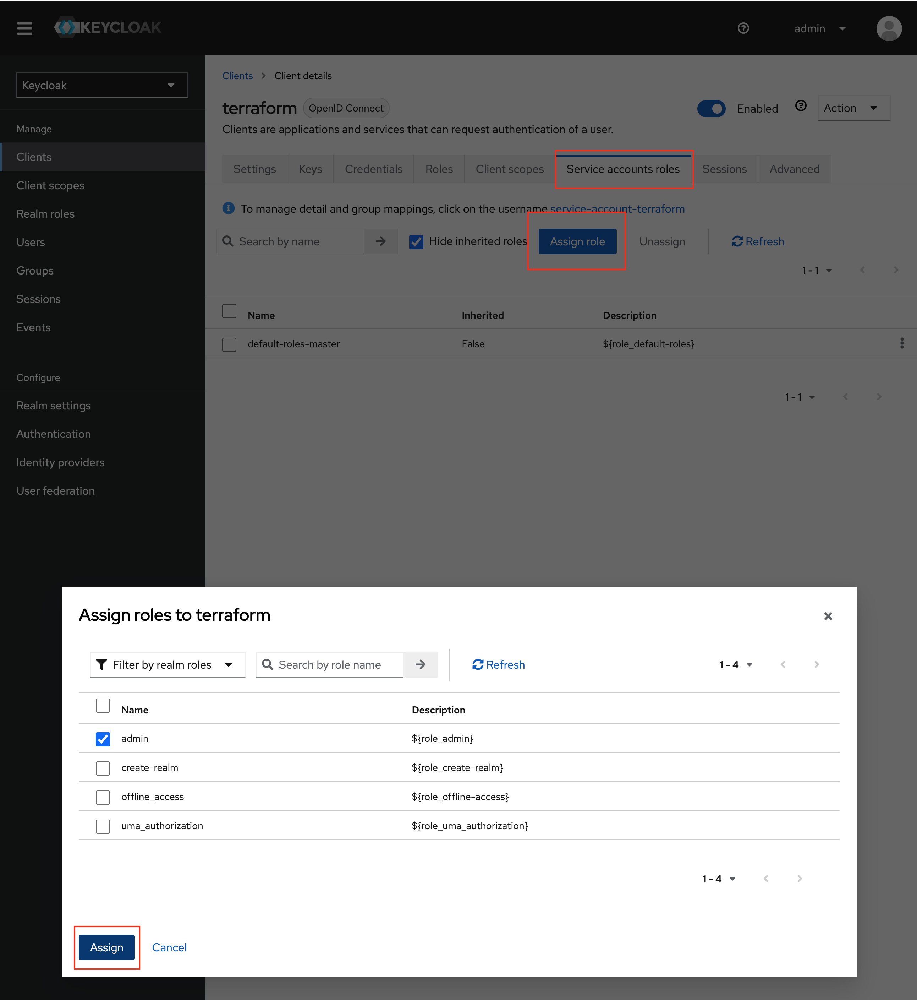

# Context
Project that explores the creation of an OAuth2 Authorization Server with Spring Boot 3, Spring Security, and Spring Authorization Server with Keycloak.

## Set up local infrastructure
Create the infrastructure needed for Keycloak by running: `docker-compose -f infrastructure/local/docker-compose.yaml up -d`

### Keycloak configuration

Chose between configuring Keycloak manually or in an automated way: 

- Manual configuration
  - Configure a Realm and Client in Keycloak
    - Open http://localhost:8081 and log in as admin/admin.
  - Create a new realm (e.g., spring-boot-app-realm)
  - Add the `ROLE_ADMIN` and `ROLE_USER` to the newly added realm
  - Create a client (e.g., spring-resource-server)
  - Configure the `Capability config` option having the Authentication flow as `Direct access grants`. Leave everything else under this section disabled. 
  - Add a User:
    - Go to Users > Add User
    - Set a username and password
    - Assign roles `ROLE_ADMIN` and `ROLE_ADMIN` to your users according your requirements
- Automated configuration via terraform
  - To apply the changes to Keycloak using Terraform, a brief manual step is required: create a client ID and secret, and assign the appropriate role. This allows Terraform to authenticate and provision the necessary resources.
    - Configure a Realm and Client in Keycloak
      - Open http://localhost:8081 and log in as admin/admin.
    - Go to the master realm and create a new Client:
      
    - Select the `Client authentication` option and mark the `Service accounts roles` option:
      
    - Leave the third step as it is:
      
    - Now go the the Clients list page and select the newly created `terraform` client: 
      
    - Navigate to the `Service accounts roles` tag, then click on `Assign role` and assign the `admin` role to the terraform client:
      
  - Get the client-secret from your terraform client:
    
  - Go to the `infrastructure/terraform` folder and create the secrets.auto.tfvars file
    - Inside the file, add this line with your secret: `keycloak_client_secret = "<your_secret_goes_here>"`
  - Yet inside the `infrastructure/terraform` folder, run `terraform apply` to apply your changes