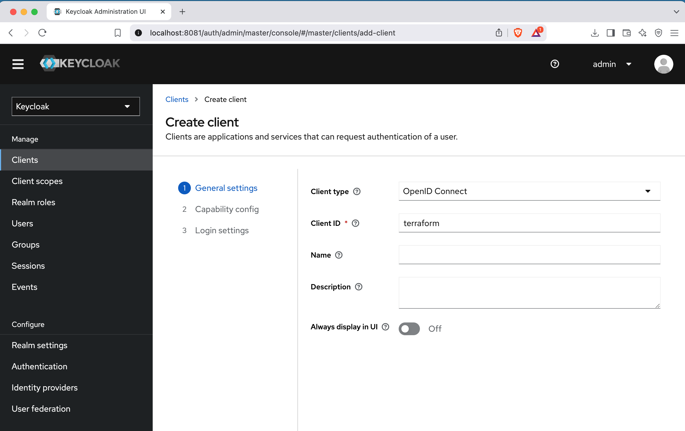
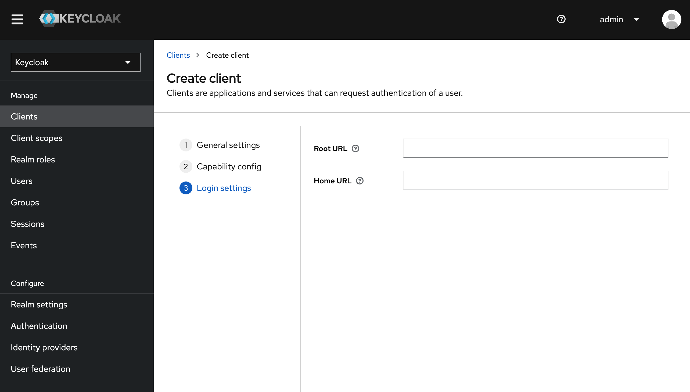
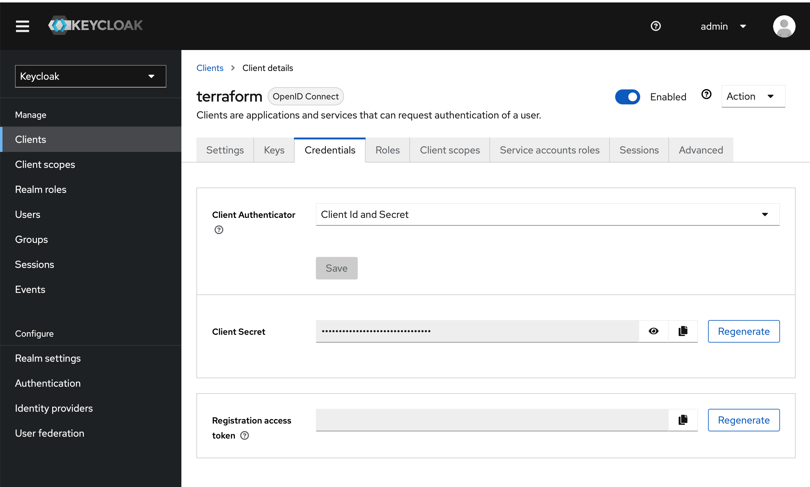

# Context
Project that explores the creation of an OAuth2 Authorization Server with Spring Boot 3, Spring Security, and Spring Authorization Server with Keycloak.

## Set up local infrastructure
Create the infrastructure needed for Keycloak by running: `docker-compose -f infrastructure/local/docker-compose.yaml up -d`

### Keycloak configuration

Chose between configuring Keycloak manually or in an automated way: 

- Manual configuration
  - Configure a Realm and Client in Keycloak
    - Open http://localhost:8081 and log in as admin/admin.
  - Create a new realm (e.g., spring-boot-app-realm)
  - Add the `ROLE_ADMIN` and `ROLE_USER` to the newly added realm
  - Create a client (e.g., spring-resource-server)
  - Configure the `Capability config` option having the Authentication flow as `Direct access grants`. Leave everything else under this section disabled. 
  - Add a User:
    - Go to Users > Add User
    - Set a username and password
    - Assign roles `ROLE_ADMIN` and `ROLE_ADMIN` to your users according your requirements
- Automated configuration via terraform
  - To apply the changes to Keycloak using Terraform, a brief manual step is required: create a client ID and secret, and assign the appropriate role. This allows Terraform to authenticate and provision the necessary resources.
    - Configure a Realm and Client in Keycloak
      - Open http://localhost:8081 and log in as admin/admin.
    - Go to the master realm and create a new Client:
      
    - Select the `Client authentication` option and mark the `Service accounts roles` option:
      
    - Leave the third step as it is:
      
    - Now go the the Clients list page and select the newly created `terraform` client: 
      
    - Navigate to the `Service accounts roles` tag, then click on `Assign role` and assign the `admin` role to the terraform client:
      
  - Get the client-secret from your terraform client:
    
  - Go to the `infrastructure/terraform` folder and create the secrets.auto.tfvars file
    - Inside the file, add this line with your secret: `keycloak_client_secret = "<your_secret_goes_here>"`
  - Yet inside the `infrastructure/terraform` folder, run `terraform apply` to apply your changes

## Authentication and Authorization tests
Make sure the app and keycloak are up and running. To start up the local environment, run: `docker-compose -f infrastructure/local/docker-compose.yaml up -d && ./mvnw spring-boot:run`
- Test with an user that has the `ROLE_USER` assigned
  - Authenticate and generate the token:
    ```curl
    TOKEN=$(curl -s -X POST "http://localhost:8081/auth/realms/spring-boot-app-realm/protocol/openid-connect/token" \
        -H "Content-Type: application/x-www-form-urlencoded" \
        -d "client_id=spring-resource-server" \
        -d "username=bob" \
        -d "password=pwdbob" \
        -d "grant_type=password" | jq -r .access_token)
    ```
  - Make sure the user can access the `/user` endpoint:
    ```curl
    curl -v -X GET http://localhost:8080/api/user -H "Authorization: Bearer $TOKEN"
    ```
    Expected: Response code 200 and a json response body like this:
    ```json
    {"sub":"0f1102b1-a4bd-47cc-b328-e19a9eb1441d","email_verified":false,"iss":"http://localhost:8081/auth/realms/spring-boot-app-realm","typ":"Bearer","preferred_username":"bob","given_name":"Bob","sid":"03b4492c-74b4-4731-a1b0-e040729dedd6","acr":"1","realm_access":{"roles":["ROLE_USER"]},"azp":"spring-resource-server","scope":"profile email","name":"Bob Bobson","exp":"2025-04-06T00:59:09Z","session_state":"03b4492c-74b4-4731-a1b0-e040729dedd6","iat":"2025-04-06T00:54:09Z","family_name":"Bobson","jti":"f8760f55-5e87-4ab4-993f-07197a14689f","email":"bob@domain.com"}
    ```
  - Make sure the user can also access the `/user-role` endpoint:
    ```curl
    curl -v -X GET http://localhost:8080/api/user-role -H "Authorization: Bearer $TOKEN"
    ```
    Expected: Response code 200 and a text response body `User has the ROLE_USER assigned`
  - Make sure the user **cannot** access the `/admin` endpoint:
    ```curl
    curl -v -X GET http://localhost:8080/api/admin -H "Authorization: Bearer $TOKEN"
    ```
    Expected: Response code 403
- Test with an user that has the `ROLE_ADMIN` assigned
  - Authenticate and generate the token:
    ```curl
    TOKEN=$(curl -s -X POST "http://localhost:8081/auth/realms/spring-boot-app-realm/protocol/openid-connect/token" \
        -H "Content-Type: application/x-www-form-urlencoded" \
        -d "client_id=spring-resource-server" \
        -d "username=alice" \
        -d "password=pwdalice" \
        -d "grant_type=password" | jq -r .access_token)
    ```
  - Make sure the user **cannot** access the `/user` endpoint:
    ```curl
    curl -v -X GET http://localhost:8080/api/user -H "Authorization: Bearer $TOKEN"
    ```
    Expected: Response code 403
  - Make sure the user **cannot** access the `/user-role` endpoint:
    ```curl
    curl -v -X GET http://localhost:8080/api/user-role -H "Authorization: Bearer $TOKEN"
    ```
    Expected: Response code 403
  - Make sure the user can access the `/admin` endpoint:
    ```curl
    curl -v -X GET http://localhost:8080/api/admin -H "Authorization: Bearer $TOKEN"
    ```
    Expected: Response code 200 and a text response body `Admin access granted!`